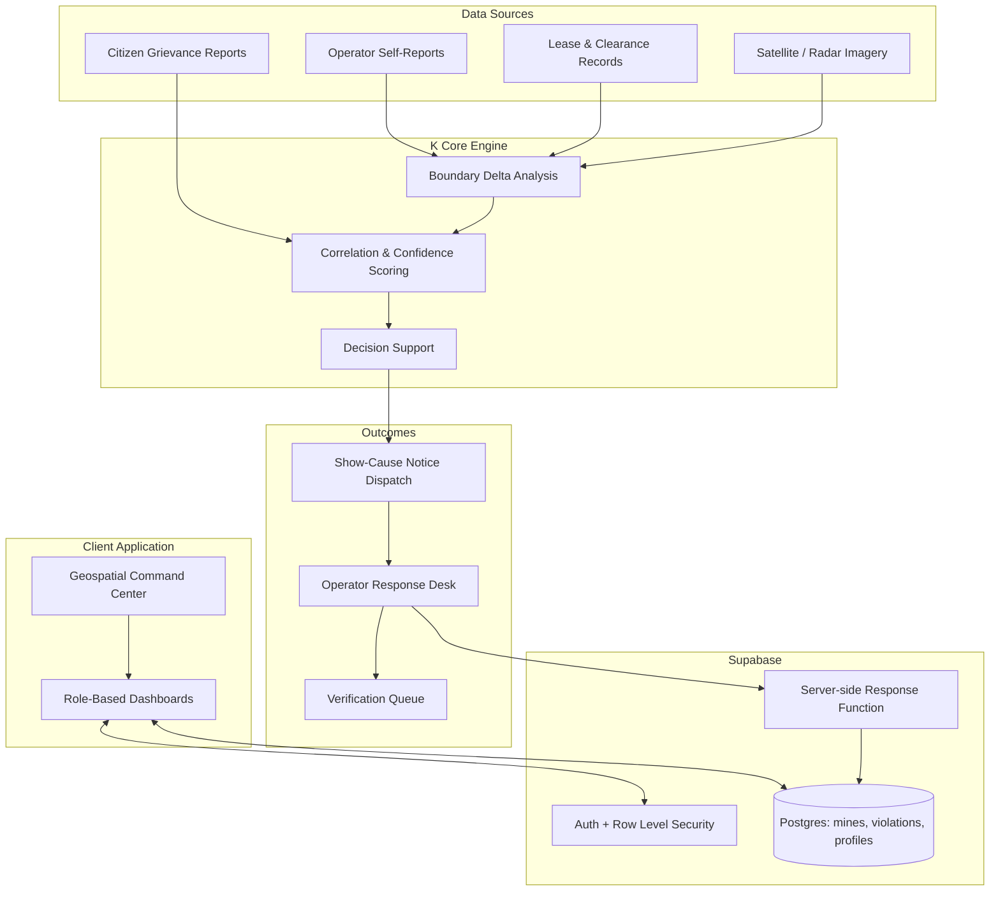
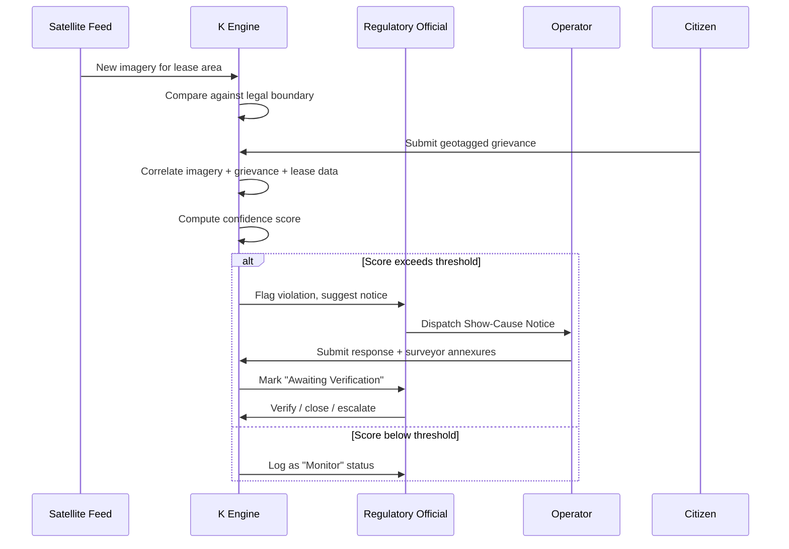

# K

**A closed-loop compliance and surveillance platform for coal mining oversight**, built for a national regulatory use case (Ministry of Coal / DGMS style workflows). It combines satellite/geospatial monitoring, lease and clearance data, and citizen-reported grievances into a single auditable pipeline — from detecting a boundary violation to dispatching a statutory notice and tracking the operator's response.

Live demo: https://k-goyb.vercel.app/

---

## Table of Contents

- [Overview](#overview)
- [Problem statement](#problemstatement)
- [Why K Exists](#why-k-exists)
- [System Architecture](#system-architecture)
- [User Roles](#user-roles)
- [Core Workflow](#core-workflow)
- [Feature Breakdown](#feature-breakdown)
- [Tech Stack](#tech-stack)
- [Project Structure](#project-structure)
- [Getting Started](#getting-started)
- [Supabase Backend Setup](#supabase-backend-setup)
- [Offline Telemetry Simulation](#offline-telemetry-simulation)
- [Roadmap](#roadmap)
  


## Overview

K unifies three data streams that are traditionally siloed in mining compliance oversight:

1. **Remote sensing data** — satellite/radar imagery used to detect changes in a mine's operational footprint.
2. **Regulatory & lease data** — the legally sanctioned boundary and clearance limits for each mine.
3. **Ground-level reports** — citizen-filed, geotagged complaints (dust, blasting, encroachment).

These streams are cross-correlated into a single confidence-scored violation record, which can trigger an automated show-cause notice and a tracked operator response cycle.


## Problem Statement

Coal mining compliance in India currently relies on manual, fragmented oversight, which creates real gaps between violation and enforcement:

| # | Problem | Impact |
|---|---|---|
| 1 | Satellite/radar monitoring runs on a separate cycle from live lease and operational data | Boundary overreach can go undetected for weeks or months before anyone cross-checks it |
| 2 | Operators have no structured channel to explain a legitimate site change before enforcement begins | Minor, explainable deviations get treated the same as deliberate violations, and disputes drag on |
| 3 | Citizen complaints (dust, blasting, encroachment) are filed in isolation | Grievances aren't automatically linked to the mine, lease boundary, or time window they relate to, so they rarely strengthen a case |
| 4 | Show-cause notices and responses are tracked manually (paper/email) | No single source of truth for "who owes a response, and by when" |
| 5 | Enforcement decisions are hard to justify after the fact | Without a documented evidence trail, actions are vulnerable to legal challenge |

**The core issue:** three independent signals — satellite imagery, regulatory/lease records, and ground-level reports — need to agree before a violation is credible enough to act on, but today nothing correlates them automatically.

K addresses this by building a single pipeline where imagery deltas, lease baselines, and citizen reports feed into one confidence-scored violation record, with every step of that reasoning kept as an auditable trail — from detection through notice dispatch to operator response and verification.
## Why K Exists

Manual compliance monitoring tends to break down in three predictable ways:

- Satellite scans are reviewed separately from live lease/operational data, so discrepancies surface late.
- Operators have no structured, auditable channel to explain a benign boundary change before enforcement action is taken.
- Citizen complaints aren't automatically linked to the mine or time window they relate to.

K's goal is to close that loop with one connected system instead of three disconnected ones.

## System Architecture



## User Roles

| Role | Access |
|---|---|
| **Regulatory Official** (Gov/DGMS-style) | National telemetry feed, breach alerts, notice generation, risk dashboards |
| **Colliery / Operator** | Compliance desk, incoming show-cause notices, response submission with annexures |
| **Field Officer** | On-ground verification, inspection records |
| **Citizen** | Public portal to file geotagged grievances |

Access is enforced through authentication plus Row Level Security at the database layer, not just in the UI.

## Core Workflow



## Feature Breakdown

- **Role-based single sign-on** — separate authenticated views for regulators, operators, and citizens.
- **Live geospatial command center** — interactive map (Leaflet) with risk-tiered mine markers, filterable by state and status.
- **Multi-source evidence chain** — a structured, step-by-step audit trail (legal baseline → operator report → imagery delta → citizen corroboration → correlation score → notice dispatch) so every enforcement action is explainable.
- **Bidirectional compliance loop** — a dispatched notice moves a mine into an "awaiting response" state; an operator's submission automatically flips it to "awaiting verification" for the regulator.
- **Offline-capable mine inspection view** — a local, IndexedDB-backed synthetic telemetry view for demoing sensor/production data shapes without a live feed.

## Tech Stack

| Layer | Technology |
|---|---|
| Frontend | React 18, TypeScript, Vite |
| Styling / Icons | Tailwind CSS, Lucide React |
| Mapping | Leaflet, React-Leaflet, CartoDB tiles |
| Backend | Supabase (Postgres, Auth, Row Level Security, Edge Functions) |
| Local storage | IndexedDB via Dexie (offline telemetry demo) |

## Project Structure
K/
├── docs/ # Documentation assets
├── public/ # Static assets
├── scripts/ # Utility / build scripts
├── src/ # Application source (components, pages, logic)
├── supabase/ # SQL migrations & backend config
├── .env.example # Environment variable template
└── package.json


## Getting Started

### Prerequisites

- Node.js v18+
- npm or yarn

### Installation

```bash
# Clone the repo
git clone https://github.com/Hiteshsingla18/K.git
cd K

# Install dependencies
npm install

# Copy environment template and fill in your Supabase keys
cp .env.example .env

# Start the dev server
npm run dev
```

## Supabase Backend Setup

1. Create a Supabase project. Copy the project URL and **anon/publishable key** into `.env` as `VITE_SUPABASE_URL` and `VITE_SUPABASE_ANON_KEY`. Never expose the service-role key to the frontend.
2. Run the migration in `supabase/migrations/` via the Supabase SQL editor or CLI.
3. Create users through Supabase Auth. A database trigger auto-creates a matching `profiles` row. Supported roles: `gov`, `operator`, `officer`, `labour`, `citizen`.
4. Seed the `mines` and `violations` tables (via Supabase Studio or a private seed script).

Row Level Security governs all data access, and operator responses run through a server-side Postgres function so a response insert and its violation-status update happen atomically.

## Offline Telemetry Simulation

The mine inspection drawer includes an offline view that generates ~24 synthetic telemetry records per mine (roughly one every 4 days over ~90 days) and stores them locally in IndexedDB. This is placeholder data shaped like a future sensor/production feed — **not real measurements or compliance evidence**. For production, swap the synthetic generator for authenticated ingestion from real IoT/environmental sensors and official production returns.

## Roadmap

- [ ] Replace synthetic telemetry with live sensor ingestion
- [ ] Automated notice-to-response SLA tracking
- [ ] Historical trend analysis per mine/lease
- [ ] Mobile-friendly citizen reporting flow

