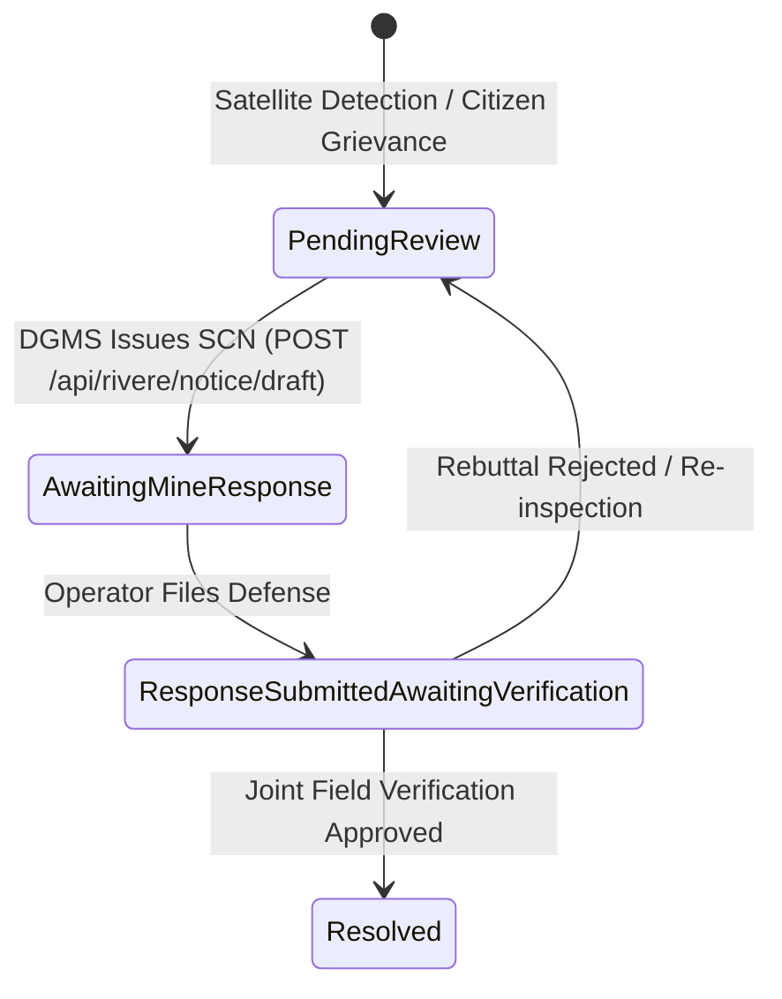

# PHASE 0: FULL REPOSITORY & LIVE APP AUDIT REPORT
**Project:** CoalGuard AI (SIH 2026 — Closed-Loop Coal Mining Compliance Platform)  
**System:** RIVERE AI System & Integrated Backend  
**Audit Date:** September 19, 2026  
**Git Branch:** `feat/rivere-backend`  

---

## 1. EXECUTIVE SUMMARY & REPOSITORY OVERVIEW

CoalGuard AI is a prototype web application designed for the Ministry of Coal / Directorate General of Mines Safety (DGMS). The running frontend is hosted at `http://172.25.160.37:3000/`.

The application enforces closed-loop compliance and multi-sensor satellite surveillance across Indian coal basins (Rajmahal, Damodar Valley, Mahanadi, Son Valley, Hasdeo-Arand, Ib Valley, Wardha Valley, Godavari Valley).

### Key Architectural Constraints:
- **Frontend Immutability:** `src/`, `public/`, `index.html`, `package.json`, `vite.config.ts`, `tsconfig.json`, `bun.lock` are strictly **read-only**.
- **Source of Truth:** Hardcoded data in `src/` (25 mines across 7 states, violation `ENV-082`, notice `SCN-2026-082`, audit trail block `#10487` to `#10492`, citizen reports `CR-882`, `CR-914`, etc.) forms the base domain model.
- **Backend Mandate:** All new functionality resides in a standalone Python FastAPI backend under `/backend`, interacting via clean REST APIs and streaming SSE contracts.

---

## 2. COMPREHENSIVE DATA DICTIONARY & SOURCE CODE INVENTORY

### 2.1 File-by-File Inventory (`src/`)

| File Path | Description / Role | Key Exports / Structures | Data Dependencies |
| :--- | :--- | :--- | :--- |
| [types.ts](file:///C:/Users/nishi/.gemini/antigravity/scratch/coalguard-ai/src/types.ts) | Core TypeScript interfaces & enums | `MineRecord`, `CitizenReportRecord`, `AuditTrailEntry`, `ViolationStatus`, `WorkforceAttendanceRecord`, `AuthUser` | Central type registry |
| [mines.ts](file:///C:/Users/nishi/.gemini/antigravity/scratch/coalguard-ai/src/data/mines.ts) | Hardcoded dataset of 25 coal mines | `MINES_DATA: MineRecord[]` | 7 states, 8 subsidiaries (ECL, BCCL, CCL, SECL, MCL, NCL, WCL, SCCL) |
| [mineRegistryDB.ts](file:///C:/Users/nishi/.gemini/antigravity/scratch/coalguard-ai/src/data/mineRegistryDB.ts) | Supabase/local fallback loader | `loadMineRegistryData()` | Tries Supabase `mines` table; falls back to `MINES_DATA` |
| [initialAttendance.ts](file:///C:/Users/nishi/.gemini/antigravity/scratch/coalguard-ai/src/data/initialAttendance.ts) | Attendance roster seeds | `INITIAL_ATTENDANCE_ROSTER` | Permanent vs Contractual workers |
| [coalGuardService.ts](file:///C:/Users/nishi/.gemini/antigravity/scratch/coalguard-ai/src/services/coalGuardService.ts) | Async API service abstraction | `coalGuardService` | Mock API wrappers for mines, violations, SCN dispatch |
| [AuthContext.tsx](file:///C:/Users/nishi/.gemini/antigravity/scratch/coalguard-ai/src/context/AuthContext.tsx) | Auth context provider & role defaults | `useAuth`, `GOV_OFFICER_USER`, `OPERATOR_USER`, `CITIZEN_USER` | LocalStorage session persistence (`coalguard_session`) |
| [App.tsx](file:///C:/Users/nishi/.gemini/antigravity/scratch/coalguard-ai/src/App.tsx) | Root router & state orchestrator | Routing (`/`, `/command`, `/operator`, `/citizen`, `/officer`, `/labour`) | Holds global violation state `pending_review` |
| [RegulatoryCopilot.tsx](file:///C:/Users/nishi/.gemini/antigravity/scratch/coalguard-ai/src/components/RegulatoryCopilot.tsx) | Chat drawer UI for AI Regulatory Assistant | Chat messages, quick prompt chips, statutory reference footers | Mocked `setTimeout` rules engine |
| [RiskPrediction.tsx](file:///C:/Users/nishi/.gemini/antigravity/scratch/coalguard-ai/src/components/RiskPrediction.tsx) | Risk & Encroachment Predictive Matrix UI | `forecastData` array, risk score cards (80%+ threshold) | Hardcoded threat metrics for 4 colleries |
| [EvidenceChain.tsx](file:///C:/Users/nishi/.gemini/antigravity/scratch/coalguard-ai/src/components/EvidenceChain.tsx) | Multi-temporal satellite comparison UI | `AUDIT_TRAIL_DATA`, XAI confidence decomposition (89.4%) | Sentinel-2 / Cartosat-3 SVG visuals |
| [OperatorPortal.tsx](file:///C:/Users/nishi/.gemini/antigravity/scratch/coalguard-ai/src/components/OperatorPortal.tsx) | Colliery Operator Desk UI | SCN clarification form, legal dossier viewer | Manages formal rebuttal filing |
| [CitizenPortal.tsx](file:///C:/Users/nishi/.gemini/antigravity/scratch/coalguard-ai/src/components/CitizenPortal.tsx) | Public Environmental Vigilance UI | `INITIAL_CITIZEN_REPORTS`, filing form, Leaflet map | Geotag spatial correlation |

---

### 2.2 Domain Data Dictionary

#### A. Mine Record (`MineRecord`)
- `id` (`string`, e.g., `'MIN-4492-R'`): Unique mine identifier.
- `name` (`string`, e.g., `'Rajmahal Open Cast Project (OCP)'`): Official mine name.
- `region` (`string`, e.g., `'Godda / Sahibganj'`): District / Coalfield region.
- `state` (`string`, Allowed: `'Jharkhand'`, `'Chhattisgarh'`, `'Odisha'`, `'West Bengal'`, `'Madhya Pradesh'`, `'Maharashtra'`, `'Telangana'`): State location.
- `subsidiary` (`string`, Allowed: `'ECL'`, `'BCCL'`, `'CCL'`, `'SECL'`, `'MCL'`, `'NCL'`, `'WCL'`, `'SCCL'`): CIL subsidiary or operating company.
- `basin` (`string`, e.g., `'Rajmahal Basin'`, `'Damodar Valley Basin'`): Geologic coal basin.
- `status` (`'critical' | 'monitor' | 'compliant'`): Compliance risk tier.
- `complianceScore` (`number`, `0..100`): Overall compliance rating.
- `operator` (`string`): Operating company name.
- `lastInspection` (`string`): Date of last physical inspection.
- `permitExp` (`string`): Permit expiration date.
- `activeReports` (`number`): Number of active violations/reports.
- `unauthorizedAreaHa` (`number`, optional): Detected unpermitted area in Hectares (e.g., `28`).
- `coalfield` (`string`): Named coalfield basin.
- `productionCapacityMTPA` (`number`): Rated capacity in Million Tonnes Per Annum (e.g., `17.0`).
- `latitude` (`number`), `longitude` (`number`): Centroid coordinates.
- `workforceSplit` (`{ permanent: number, contractual: number, total: number }`): Workforce breakdown.

#### B. Citizen Report Record (`CitizenReportRecord`)
- `id` (`string`, e.g., `'CR-882'`): Unique report reference.
- `pin` (`string`, 4-digit, e.g., `'1428'`): Tracking PIN code.
- `mineId` (`string`): Target mine ID.
- `village` (`string`): Reporting village / panchayat.
- `category` (`string`): Category label.
- `categoryKey` (`'boundary_encroachment' | 'dust_air_pollution' | 'blasting_vibration' | 'water_contamination'`): Machine key.
- `stage` (`1 | 2 | 3 | 4 | 5`): Workflow stage (1: Submitted, 2: Satellite Cross-Check, 3: Corroborated, 4: SCN Dispatched, 5: Verified/Resolved).
- `geotagCorrelationPct` (`number`, e.g., `98.4`): Spatial proximity match score.

---

## 3. AI SURFACE ANALYSIS & INTERFACE CONTRACTS

### 3.1 AI Surface 1: Rivere Copilot (`RegulatoryCopilot.tsx`)
- **Current Behavior:** Hardcoded keyword matching in `setTimeout` returning fixed strings for Rajmahal OCP, Rule 14(b), SCN draft, and Cartosat-3 methodology.
- **Required API Endpoint:** `POST /api/rivere/copilot/chat` (Server-Sent Events streaming).
- **Request Body:**
  ```json
  {
    "query": "Summarize statutory violations for Rajmahal OCP",
    "selected_mine_id": "MIN-4492-R",
    "role": "gov",
    "conversation_history": []
  }
  ```
- **Response Format (SSE Stream):**
  ```json
  {
    "event": "message",
    "data": {
      "id": "msg_1726756800",
      "text_delta": "Rajmahal OCP (Notice SCN-2026-082) Breach Summary:\n...",
      "statutory_reference": "MoEFCC Reg 14(b) & DGMS Notice SCN-2026-082",
      "tool_calls": [{"name": "get_violation", "args": {"id": "ENV-082"}}],
      "fallback": false
    }
  }
  ```

### 3.2 AI Surface 2: Rivere Forecast (`RiskPrediction.tsx`)
- **Current Behavior:** Hardcoded text metrics in `RiskPrediction.tsx` without chart time-series data.
- **Required API Endpoint:** `GET /api/rivere/forecast/production?mine_id=MIN-4492-R&horizon=12`
- **Response Format:**
  ```json
  {
    "mine_id": "MIN-4492-R",
    "mine_name": "Rajmahal Open Cast Project (OCP)",
    "rated_capacity_mtpa": 17.0,
    "historical": [
      {"month": "2025-04", "production_tonnes": 1410000},
      {"month": "2025-05", "production_tonnes": 1450000}
    ],
    "forecast": [
      {
        "month": "2026-10",
        "point_forecast_tonnes": 1520000,
        "ci_80_lower": 1410000,
        "ci_80_upper": 1630000,
        "ci_95_lower": 1350000,
        "ci_95_upper": 1690000,
        "ec_cap_exceeded": true
      }
    ],
    "key_drivers": ["Peak fiscal year-end excavation surge", "Monsoon recovery dip"]
  }
  ```

### 3.3 AI Surface 3: Rivere Risk & Encroachment Engine (`EvidenceChain.tsx` & `RiskPrediction.tsx`)
- **Current Behavior:** Hardcoded 89.4% confidence score, fixed 28.42 Ha delta, and manual SHAP weights (38% NDVI, 32% SAR, 19.4% Citizen).
- **Required API Endpoint:** `GET /api/rivere/risk/{mine_id}`
- **Response Format:**
  ```json
  {
    "mine_id": "MIN-4492-R",
    "risk_score": 94,
    "risk_tier": "Critical Deviation",
    "breach_probability": 0.894,
    "confidence_decomposition": {
      "ndvi_vegetation_loss_pct": 38.0,
      "sar_surface_disturbance_pct": 32.0,
      "citizen_corroboration_pct": 19.4,
      "model_uncertainty_pct": 10.6
    },
    "primary_threat": "Statutory Lease Line Breach (+28 Ha)",
    "shap_explanations": [
      {"feature": "NDVI Canopy Delta", "importance": 0.38, "value": "-71.8%"},
      {"feature": "SAR Backscatter Shift", "importance": 0.32, "value": "+1.2m bench shift"},
      {"feature": "Geotag Density", "importance": 0.194, "value": "14 reports <120m"}
    ]
  }
  ```

### 3.4 AI Surface 4: Show-Cause Notice Drafting (`EvidenceChain.tsx` / `OperatorPortal.tsx`)
- **Required API Endpoint:** `POST /api/rivere/notice/draft`
- **Request Body:**
  ```json
  {
    "violation_id": "ENV-082",
    "mine_id": "MIN-4492-R",
    "breach_details": {"encroachment_ha": 28.42, "coordinates": "25.0486° N, 87.3982° E"}
  }
  ```

---

## 4. BIDIRECTIONAL COMPLIANCE WORKFLOW TRANSITIONS



---

## 5. UI SCREENSHOTS MATRIX

Screenshots captured from live application at `http://172.25.160.37:3000/`:

| Screen Index | Screen Name | Role | Saved Location |
| :--- | :--- | :--- | :--- |
| `01` | Auth Gateway & Role Directory | Public / Entry | `docs/screens/01_auth_gateway.png` |
| `02` | DGMS Surveillance Overview & Map | DGMS Official | `docs/screens/02_dgms_overview.png` |
| `03` | DGMS Mine Explorer Registry | DGMS Official | `docs/screens/03_dgms_mine_explorer.png` |
| `04` | Evidence Center & XAI (ENV-082) | DGMS Official | `docs/screens/04_dgms_evidence_center.png` |
| `05` | Q4 Predictive Risk Matrix | DGMS Official | `docs/screens/05_dgms_risk_prediction.png` |
| `06` | Citizen Grievance Corroboration | DGMS Official | `docs/screens/06_dgms_citizen_reports.png` |
| `07` | Regulatory AI Copilot Drawer | DGMS Official | `docs/screens/07_dgms_copilot_drawer.png` |
| `08` | Colliery Operator Notice Desk | Colliery Operator | `docs/screens/08_operator_notice_desk.png` |
| `09` | Operator Lease Radar & DGPS Map | Colliery Operator | `docs/screens/09_operator_lease_radar.png` |
| `10` | Operator Workforce & Roster | Colliery Operator | `docs/screens/10_operator_workforce.png` |
| `11` | Citizen Concern Filing Form | Citizen | `docs/screens/11_citizen_file_concern.png` |
| `12` | Citizen Report Tracker (PIN Lookup)| Citizen | `docs/screens/12_citizen_track_report.png` |
| `13` | Citizen Public Mine & Village Map | Citizen | `docs/screens/13_citizen_public_map.png` |
| `14` | Mine Safety Officer Field Portal | Field Officer | `docs/screens/14_officer_portal.png` |
| `15` | Labour Mobile App & Geofence | Labour Worker | `docs/screens/15_labour_app.png` |

---

## 6. ASSUMPTIONS, DATA GAPS & IMPLEMENTATION PLAN

1. **Production Time-Series Gap:** Prototype UI features `productionCapacityMTPA` (e.g., 17.0 MTPA for Rajmahal) but lacks monthly historical production series. In Phase 1, we will ingest Ministry of Coal / Coal India Ltd subsidiary production data (ECL, BCCL, CCL, SECL, MCL, NCL, WCL, SCCL) to build calibrated monthly series tagged `derived_from=ECL_basin_share`.
2. **Deterministic LLM Fallback:** The backend will support live LLM inference (via Qwen2.5/Llama-3.2 fine-tuned weights or CPU smoke test) with a deterministic tool-backed fallback when offline, flagging `"fallback": true`.
3. **CORS Integration Strategy:** Frontend is read-only. `docs/INTEGRATION.md` will document the exact fetch hook snippets to plug into `coalGuardService.ts` when ready.

---
*End of Audit Report.*
